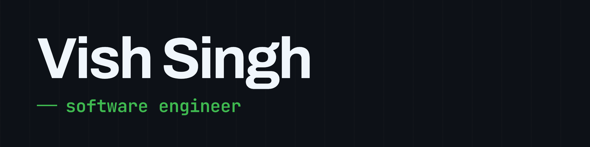
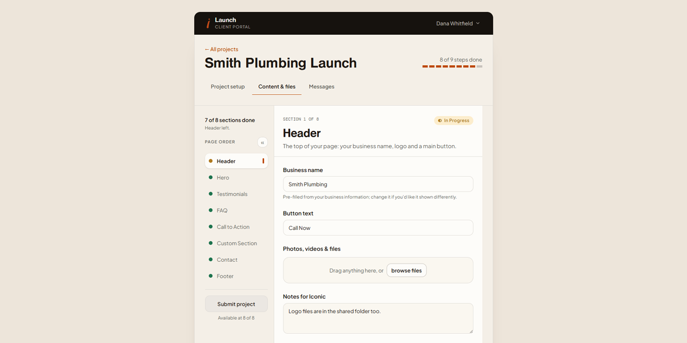

  

<!-- <h1 align="center">Vish Singh</h1> -->

<!-- 

  

 -->

  I build web &amp; healthcare applications that save business time, reduce operational costs and improve user experience across small business, nonprofit and clinical settings.

  
  
  

  
  
  

## Selected work

### [Launch](https://launch.iconicweb.dev/) &nbsp;·&nbsp; client project intake &amp; collaboration platform

A full-stack application for managing website projects, collecting client content and files, and communicating with clients throughout the project lifecycle.

`React` `TypeScript` `Supabase` `PostgreSQL` `Tailwind` `Resend`

[Live app](https://launch.iconicweb.dev/) &nbsp;·&nbsp; [Source](https://github.com/vishalicious213/launchpad-portal)

## Stack

<table>
  <tr>
    <td align="left" valign="top"><b>LANGUAGES</b></td>
    <td valign="top">  </td>
  </tr>
  <tr>
    <td align="left" valign="top"><b>FRONT-END</b></td>
    <td valign="top">     </td>
  </tr>
  <tr>
    <td align="left" valign="top"><b>FRAMEWORKS</b></td>
    <td valign="top">  </td>
  </tr>
  <tr>
    <td align="left" valign="top"><b>BACK-END</b></td>
    <td valign="top">   </td>
  </tr>
  <tr>
    <td align="left" valign="top"><b>DATA &AMP; APIS</b></td>
    <td valign="top">      </td>
  </tr>
  <tr>
    <td align="left" valign="top"><b>AI DEVELOPMENT</b></td>
    <td valign="top">   </td>
  </tr>
  <tr>
    <td align="left" valign="top"><b>OTHER</b></td>
    <td valign="top">     </td>
  </tr>
</table>

---

  Food, family &amp; 🤘 metal 🤘 · NY → CA, 2020

